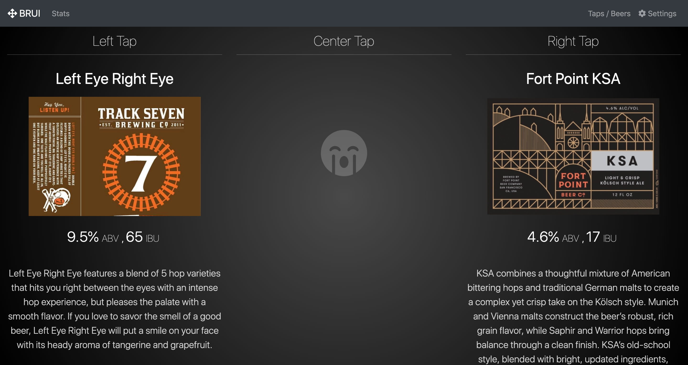

# BRUI

BRUI displays beer menus for kegarators with 1 to 3 taps and even tracks pours when coupled with flow sensors and the BRUI PCB. The entire project is open source including the PCB designs so feel free to take, use, and contribute.




## Equipment

BRUI runs entirely on a raspberry pi running raspbian with internet access ( for images ). You should buy the fast raspberry pi you can find: pi 3 B+ at the time of this writing. You can optionally build a BRUI PCB which will allow you to plug your flow sensors directly to your raspberry pi.

The BRUI application is written in nodejs and must be running on the pi at all times in order to track pours via the flow sensors. The frontend is written in VueJS.

### Flow Sensors

I used the Titan 300 flow sensors purchased from here:
https://brewskey.myshopify.com/products/titan-300-flow-sensor

These are a little pricy - I'm pretty sure any similarly rated food-grade hall effect flow sensor will work.

### Temperature Sensor

Coming Soon


### Brui PCB

You don't really need a PCB to connect the flow sensors to the raspberry pi but I wanted something nice looking.

You can order a bare PCB from OSH Park here for less than $15:
[](https://oshpark.com/shared_projects/nq7zyTg5)

The source KiCad files can be found in this project:
[KiCad Archive](/hardware/Brui-PCB-KiCad.zip)

The BOM can be found here ( all parts available from Mouser except for the Titan 300 flow sensors ):
[BRUI BOM](/hardware/bom.md)


## Raspbian setup

Install pigpio: `sudo apt-get install pigpio`

I had trouble with `brui/npm install` freezing up. I ran the command below first:

```
sudo apt-get install libsqlite3-dev
npm install sqlite3 --build-from-source --sqlite=/usr
```

And then ran `brui/npm install`.


### Optimize for Kiosk Experience

1. Remove unused packages:
  1. `sudo apt-get purge wolfram-engine scratch scratch2 nuscratch sonic-pi idle3 -y`
  2. `sudo apt-get purge smartsim java-common minecraft-pi libreoffice* -y`
2. Free up space
  1. `sudo apt-get clean`
  2. `sudo apt-get autoremove -y`
3. Install tools to simulate key presses and hide the mouse cursor
  1. `sudo apt-get install xdotool unclutter sed`

### Starting BRUI on boot
1. Create a system.d service file: `sudo nano /lib/systemd/system/brui.service`
2. Paste in these contents and tailor as needed:
```
[Unit]
Description=Run the BRUI app on boot with forever
After=multi-user.target

[Service]
ExecStart=forever -a -o /home/pi/brui/stdout.log -e /home/pi/brui/stderr.log --sourceDir=/home/pi/brui -p /home/pi/brui api/server.js --$

[Install]
WantedBy=multi-user.target
```
3. Reload the systemd services: `systemctl daemon-reload`
4. Start the service: `systemctl start brui.service`
5. Check the status: `systemctl status brui.service`

### x11vnc to remote into the main instance

#### Install x11vnc
1. `sudo apt-get install x11vnc`
2. `x11vnc -storepasswd`

#### Autostart x11vnc
1. `cd ~/.config`
2. `mkdir autostart` unless it already exists
3. `cd autostart`
4. `nano x11vnc.desktop`
5. paste following text:

```
[Desktop Entry]
Encoding=UTF-8
Type=Application
Name=X11VNC
Comment=
Exec=x11vnc -forever -usepw -display :0 -ultrafilexfer
StartupNotify=false
Terminal=false
Hidden=false
```

6. Save the file and reboot
7. `sudo apt-get install autocutsel` to enable copy / paste
8. Add `autocutsel -fork` to `/home/pi/.vnc/xstartup` to run autocutsel ( this didn't work for me )


#### Connect to the pi using x11vnc

1. Open OSX ScreenSharing application and connect to `vnc://[ip address of pi]`.


## Running locally

Start the API server by running `npm run server` or run the 'Run Server' configuration in VSCode.

Start the Vue dev server by running `npm run serve`

The server supports the following arguments:

* `environment` - Chooses which sqlite database file in the `database` folder to use. By default it will use the `dev` datbase. Options include `dev`, `test`, or `prod`.
* `flow_meter` - Enables the live flow meter.
